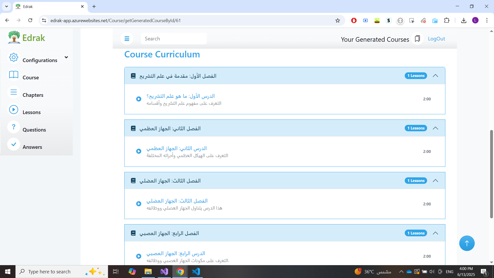

# 🎓 Educational Course Generator

![Project Banner][Insert path to banner image here]

## 📌 Project Overview

This project is a **web-based application** designed to generate structured educational courses based on user inputs such as:

- Course name & details
- Number of chapters and lessons per chapter
- Language and target audience (character)
- Question configurations (number of questions per difficulty level)

The application uses **AI** to generate complete course content, including **video lessons** for each lesson and **related questions**. It is built with **ASP.NET MVC** for both frontend and backend and is hosted on **Microsoft Azure** using **MS SQL Server** for storage.

The architecture focuses on **scalability**, **maintainability**, and **robust data handling**, incorporating:
- Repository & Unit of Work design patterns
- Authentication & authorization
- Model validation for data integrity

## 🚀 Features

### ✅ Course Generation
- Structured course generation with chapters, lessons, and questions
- AI-generated video lessons and assessments

### 🧠 AI Integration
- Sends course configurations to AI
- Receives back full course content (videos + questions)

### 🛠 CRUD Operations for:
- Course Categories
- Courses
- Course Levels
- Course Configurations
- Question Configurations
- Chapters
- Lessons
- Questions
- Answers
- Question Levels

### 📡 API Integration
- **POST API 1**: Send course & question configurations to AI  
  
- **POST API 2**: Receive generated course content from AI  
 
- **6 GET APIs** to retrieve specific course information

### ⚙️ Additional Highlights
- Model validation to ensure correct input
- Git & GitHub for version control
- LINQ & Entity Framework for database querying
- ViewModels for frontend data flow
- DTOs for clean API communication

## 🧰 Tech Stack

| Layer           | Technology                        |
|----------------|------------------------------------|
| Backend         | ASP.NET MVC                        |
| Frontend        | ASP.NET MVC with Razor Views       |
| Database        | MS SQL Server                      |
| Hosting         | Microsoft Azure                    |
| ORM             | Entity Framework                   |
| Patterns        | Repository, Unit of Work           |
| Version Control | Git & GitHub                       |
| APIs            | REST (2 POST, 6 GET)               |
| Data Transfer   | DTOs & ViewModels                  |
| Querying        | LINQ                               |
| Security        | Auth + Role-based Authorization    |

## 🗂 Project Structure

- `Controllers/`: Handle frontend views and API routes
- `Models/`: Define data entities (Courses, Lessons, etc.)
- `ViewModels/`: Bind form data for CRUD views
- `DTOs/`: Used for sending/receiving API data
- `Repositories/`: Custom data access using Repository pattern
- `UnitOfWork/`: Transaction management
- `Migrations/`: For database schema updates

## 🧪 Validation
- Uses built-in ASP.NET model validations to prevent invalid or incomplete data entry

## 🛠️ Setup Instructions

1. **📥 Clone the Repository**
   ```bash
   git clone https://github.com/[your-repo-url]
   ```
   ![Clone Repository Screenshot][Insert path to screenshot here]

2. **🔧 Install Dependencies**
   - Make sure .NET SDK and ASP.NET MVC are installed
   - Restore packages:
     ```bash
     Update-Package -reinstall
     ```
   ![Install Dependencies Screenshot][Insert path to screenshot here]

3. **🗄️ Database Setup**
   - Set connection string in `Web.config`
   - Run EF migrations:
     ```bash
     Update-Database
     ```
   ![Database Setup Screenshot][Insert path to screenshot here]

4. **☁️ Configure Azure**
   - Deploy the project to Microsoft Azure
   - Add the API URLs for AI integration
   ![Azure Configuration Screenshot][Insert path to screenshot here]

5. **▶️ Run the App**
   - Via Visual Studio or CLI:
     ```bash
     dotnet run
     ```
   ![Run Application Screenshot][Insert path to screenshot here]

## 🧑‍🏫 Usage

1. **Create a Course**
   - Navigate to the course creation page
   - Fill in course details (name, chapters, lessons, language, etc.)
   - Submit the course → sends data to AI via POST API
   ![Create Course Screenshot][Insert path to screenshot here]

2. **Receive Generated Content**
   - AI processes the request and sends back:
     - Video lesson per lesson
     - Related questions by difficulty
   ![Receive Content Screenshot][Insert path to screenshot here]

3. **Manage Courses**
   - Use CRUD UI to edit or delete:
     - Chapters
     - Lessons
     - Questions
     - Configurations
  
4. **Query Course Info**
   - Use GET APIs to fetch course data as needed
   ![Query Data Screenshot][Insert path to screenshot here]

## 📸 Screenshots

### 🔐 Login
  
> Secure login interface for users.

---

### 🧾 All Generated Courses
  
> Displays a list of all AI-generated courses.

---

### ➕ Add New Course
  
> Form to input course details before generation.

---

### 🛠️ Add Course Configurations
  
> Configuration options for chapters, lessons, etc.

---

### ❓ Add Question Configuration
  
> Customize number and difficulty of questions.

---

### 📘 Course View
  
> Detailed information for each course.

---

### 📚 Generated Course Curriculum
  
> Full chapter and lesson breakdown of the generated course.

---

### 📄 Generated Course Details
  
> Metadata, objectives, and structure of a course.

---

### 🎥 Generated Video Lesson
  
> AI-generated educational video preview for a lesson.

---

### ❓ Questions Overview
  
> All questions generated per lesson with difficulty labels.


## 📈 Future Enhancements
- Add more customizable AI options
- Real-time learner progress tracking
- Multilingual course generation
- Upgrade frontend using React or Angular

## 🤝 Contributing
1. Fork the repo
2. Create a new branch:
   ```bash
   git checkout -b feature-branch
   ```
3. Commit your changes:
   ```bash
   git commit -m "Add feature"
   ```
4. Push to GitHub:
   ```bash
   git push origin feature-branch
   ```
5. Create a Pull Request

## 📜 License
This project is licensed under the MIT License. See the `LICENSE` file for details.

## 📬 Contact
For questions or support, contact the project maintainer at 📧 lobna.saleh2003@gmail.com
